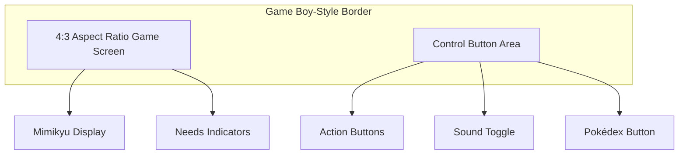

# **🎮 Game Boy-Style Design Specifications**

## **🖼️ Design Overview**

The Pokémon Adoption Program is being enhanced with a Game Boy-inspired interface to provide a consistent display across all devices and improve mobile usability. This retro aesthetic also reinforces the nostalgic Pokémon theme.



## **📏 Core Design Principles**

1. **Fixed Aspect Ratio**: Using a 4:3 game screen ratio inside a decorative border
2. **Consistent Display**: Same appearance across all devices regardless of screen size
3. **Nostalgic Aesthetic**: Game Boy-inspired visual style
4. **Optimized Touch Controls**: Buttons properly sized and positioned for mobile interaction
5. **Enhanced Visual Appeal**: Decorative elements that complement the Pokémon theme

## **🎨 Required Design Assets**

### **Border and Frame Elements**

| Asset | Description | Dimensions | Format |
|-------|-------------|------------|--------|
| Main Border | Decorative frame surrounding the game screen | 1500×1200px | PNG with transparency |
| Screen Frame | Inner frame for the game screen area | Proportional to main border | PNG with transparency |
| Background Texture | Optional tileable background | 500×500px | PNG |

### **Button Designs**

| Asset | Description | Dimensions | Format |
|-------|-------------|------------|--------|
| Feed Button | Button with food icon | 100×100px | PNG with transparency |
| Play Button | Button with play icon | 100×100px | PNG with transparency |
| Clean Button | Button with cleaning icon | 100×100px | PNG with transparency |
| Sleep Button | Button with sleep icon | 100×100px | PNG with transparency |
| Sound Toggle | Button for muting/unmuting | 100×100px | PNG with transparency |
| Pokédex Button | Button for opening Pokédex | 100×100px | PNG with transparency |

## **🧩 Layout Specifications**

### **Game Screen**
- **Aspect Ratio**: 4:3 (classic Game Boy proportions)
- **Content**: Contains Mimikyu animations and needs indicators
- **Position**: Centered within the main Game Boy border

### **Control Area**
- **Position**: Below the game screen within the Game Boy border
- **Button Spacing**: 20-30% spacing between buttons
- **Touch Target Size**: Minimum 48×48px for all interactive elements

### **Responsive Behavior**
- Entire "console" scales proportionally based on viewport
- Maximum size limits prevent excessive scaling on large screens
- Both portrait and landscape orientations supported

## **🎨 Style Guide**

### **Color Palette**
- **Primary**: Game Boy green (#9BBC0F) or classic Game Boy gray (#8B956D)
- **Secondary**: Pikachu yellow (#FCD02F) for accents
- **Text**: Dark gray (#333333) for readable text
- **Buttons**: Using colors that match the Game Boy theme

### **Typography**
- **Primary Font**: Pixel-style font for headings and titles
- **Secondary Font**: Clean sans-serif for readability in smaller text
- **Button Labels**: Uppercase for visibility, pixel font if possible

### **Visual Elements**
- Pikachu/Mimikyu pixel art decorations
- Pokéball designs in corners or as accents
- Pixel-style decorative elements consistent with Game Boy aesthetic

## **📱 Mobile Optimization Requirements**

### **Touch Interactions**
- All buttons must have sufficient touch targets (minimum 48×48px)
- Proper spacing between interactive elements to prevent accidental taps
- Clear visual feedback on button press

### **Pokédex Modal Improvements**
- Enable momentum-based scrolling with `-webkit-overflow-scrolling: touch`
- Ensure proper event propagation for touch events
- Fix body scrolling when modal is open

## **📋 Implementation Checklist**

1. Create and organize all design assets in `/assets/gameboy/` directory
2. Update HTML structure to accommodate new layout
3. Implement CSS for Game Boy border and fixed aspect ratio
4. Update button styling and positioning
5. Fix Pokédex modal scrolling for touch devices
6. Test on multiple device sizes and orientations
7. Optimize performance for mobile devices

## **💡 Design Notes**

- Consider optional "screen glare" effect for added authenticity
- Buttons can have both normal and pressed states for better feedback
- Day/night cycle can be preserved within the fixed game screen
- Add subtle pixel-style transitions between screens
- Consider adding Game Boy-style startup animation

## **📐 Technical Specifications**

### **Asset Organization**
```
assets/
└── gameboy/
    ├── border.png
    ├── screen-frame.png
    ├── buttons/
    │   ├── feed.png
    │   ├── play.png
    │   ├── clean.png
    │   ├── sleep.png
    │   ├── sound.png
    │   └── pokedex.png
    └── decorative/
        ├── corner-pokeball.png
        ├── pikachu-decoration.png
        └── background-texture.png
```

### **HTML Structure**
```html
<div class="gameboy-container">
    <div class="gameboy-border">
        <div class="game-screen">
            <!-- Existing game content -->
        </div>
        <div class="gameboy-controls">
            <!-- Action buttons -->
        </div>
    </div>
</div>
```

### **CSS Approach**
```css
.gameboy-container {
    width: 100%;
    height: 100%;
    display: flex;
    justify-content: center;
    align-items: center;
}

.gameboy-border {
    position: relative;
    width: 100%;
    max-width: 800px;
    aspect-ratio: 3/4; /* Overall Game Boy proportions */
}

.game-screen {
    position: absolute;
    top: 15%;
    left: 15%;
    width: 70%;
    height: 50%;
    aspect-ratio: 4/3; /* Game screen proportions */
}
