# **🧱 systemPatterns.md**

## **🏗️ System Architecture**

The Pokémon Adoption Program follows a **modular architecture** with these key components:

```mermaid
flowchart TD
    UI[UI Layer] --> GameState[Game State]
    GameState --> UI
    
    GameState --> NeedsSystem[Needs System]
    GameState --> AnimationSystem[Animation System]
    GameState --> SoundSystem[Sound System]
    GameState --> SaveSystem[Save System]
    
    UserInput[User Input] --> ActionHandler[Action Handler]
    ActionHandler --> GameState
    
    NeedsSystem --> TimeManager[Time Manager]
    
    UI --> PokedexSystem[Pokédex System]
```



## **🎮 Core System Components**

### **1. Game State**
- **Central state object** maintaining Mimikyu's current condition
- Implements the **Observer pattern** to notify systems of state changes
- Serves as the **single source of truth** for the game's current status

### **2. Needs System**
- Manages the four core needs: **Hunger, Happiness, Cleanliness, Energy**
- Implements **decay timers** that reduce stats over time
- Uses **threshold logic** to determine Mimikyu's mood based on combined needs

### **3. Animation System**
- Controls sprite selection based on Mimikyu's current state using a grid-based animation system
- Handles **sprite sheet animations** for different emotional states with varied grid layouts
- Supports multiple frame configurations (4×8, 10×8, 2×8, 2×1, 9×8 grids)
- Implements **frame-by-frame rendering** with proper grid coordinate mapping
- Uses **fixed-duration animations** for special interactions (hop, clean)
- Provides **XML-based timing** for standard animations (idle, hungry, sleep)
- Includes simple debug interface for testing animations

### **4. Sound System**
- Manages playback of sound effects and background music
- Implements **audio context management** for browser compatibility
- Handles **interaction feedback** through appropriate sound selection
- Uses **periodic interval system** for hungry state sound alerts (every 5 seconds)
- Implements **background music pausing** during important sound effects
- Provides proper **sound cleanup** to prevent audio conflicts
- Coordinates sound effects between **mood changes** and **animation completions**

### **5. Save System**
- Uses **LocalStorage** for persistent game state
- Implements **auto-save** on state changes
- Handles **data migration** for version updates

### **6. Time Manager**
- Tracks real-world time between sessions
- Calculates **appropriate decay** based on time elapsed
- Prevents **excessive punishment** for long absences

### **7. Pokédex System**
- Provides detailed **information about Mimikyu** through an accessible modal interface
- Implements **responsive UI design** with mobile-first approach
- Features **interactive stat bars** with color coding for different attributes
- Contains comprehensive data on Mimikyu's **type, abilities, base stats, and more**
- Uses **isolated module pattern** that doesn't affect core gameplay

## **⚙️ Key Design Patterns**

### **State Management Pattern**
```javascript
// Central state object with getters/setters that trigger updates
const gameState = {
  needs: {
    hunger: 100,
    happiness: 100,
    cleanliness: 100,
    energy: 100
  },
  mood: "happy",
  observers: [],
  
  updateNeed(need, value) {
    this.needs[need] = value;
    this.calculateMood();
    this.notifyObservers();
  },
  
  registerObserver(observer) {
    this.observers.push(observer);
  },
  
  notifyObservers() {
    this.observers.forEach(observer => observer.update(this));
  }
};
```

### **Observer Pattern**
- UI components observe game state
- Animation system observes mood changes
- Sound system observes interactions and mood shifts

### **Enhanced Animation System**
```javascript
class SpriteAnimator {
    constructor(canvas) {
        this.canvas = canvas;
        this.ctx = canvas.getContext('2d');
        
        // Grid layout data for sprite sheets
        this.gridLayouts = {
            [STATE_IDLE]: { columns: 4, rows: 8 },
            [STATE_HUNGRY]: { columns: 10, rows: 8 },
            [STATE_SAD]: { columns: 2, rows: 8 },
            [STATE_SLEEP]: { columns: 2, rows: 1 },
            [STATE_HOP]: { columns: 10, rows: 8 },
            [STATE_CLEAN]: { columns: 9, rows: 8 }
        };
        
        // Animation data with frame counts
        this.animationData = {
            [STATE_IDLE]: { frames: 32, loop: true },
            [STATE_HUNGRY]: { frames: 80, loop: true },
            [STATE_SAD]: { frames: 16, loop: true },
            [STATE_SLEEP]: { frames: 2, loop: true },
            [STATE_HOP]: { frames: 80, loop: false },
            [STATE_CLEAN]: { frames: 72, loop: false }
        };
        
        // XML-derived frame durations (in game ticks)
        this.frameDurations = {
            [STATE_IDLE]: [40, 6, 6, 6],
            [STATE_SAD]: [2, 8],
            [STATE_SLEEP]: [30, 35],
            [STATE_HOP]: [2, 1, 2, 3, 4, 4, 3, 2, 1, 2],
            [STATE_HUNGRY]: [2, 2, 2, 2, 2, 2, 2, 2, 2, 2],
            [STATE_CLEAN]: [2, 2, 2, 2, 2, 2, 2, 2, 2]
        };
    }
    
    // Main animation method with special handling
    playAnimation(animationName, onComplete = null) {
        // Special fixed-duration animations
        if (animationName === STATE_HOP) {
            this.playHopAnimation(onComplete);
            return;
        } else if (animationName === STATE_CLEAN) {
            this.playCleanAnimation(onComplete);
            return;
        }
        
        // Standard XML-based timing for other animations
        this.startStandardAnimation(animationName, onComplete);
    }
    
    // Special handler for hop animation
    playHopAnimation(onComplete) {
        // Fixed 8-second duration for hop animation
        const totalFrames = this.animationData[STATE_HOP].frames;
        const totalDuration = 8000; // 8 seconds
        const frameInterval = totalDuration / totalFrames;
        
        // Implement fixed-timing animation
        this.runFixedDurationAnimation(STATE_HOP, totalDuration, onComplete);
    }
    
    // Special handler for clean animation
    playCleanAnimation(onComplete) {
        // Fixed 7-second duration for clean animation
        const totalFrames = this.animationData[STATE_CLEAN].frames;
        const totalDuration = 7000; // 7 seconds
        
        // Implement fixed-timing animation
        this.runFixedDurationAnimation(STATE_CLEAN, totalDuration, onComplete);
    }
    
    // Calculate frame position in grid
    drawFrame() {
        // Get grid layout for current animation
        const gridLayout = this.gridLayouts[this.currentAnimation];
        
        // Convert 1D frame index to 2D coordinates
        const column = this.currentFrame % gridLayout.columns;
        const row = Math.floor(this.currentFrame / gridLayout.columns);
        
        // Calculate source rectangle in sprite sheet
        const sourceX = column * frameWidth;
        const sourceY = row * frameHeight;
        
        // Draw the specific frame to canvas
        this.ctx.drawImage(
            sprite,
            sourceX, sourceY,
            frameWidth, frameHeight,
            destX, destY,
            destWidth, destHeight
        );
    }
}
```

### **Enhanced Sound System**
```javascript
class SoundSystem {
    constructor() {
        // Sound effects storage
        this.sounds = {};
        
        // Background music reference
        this.backgroundMusic = null;
        
        // Mute state tracking
        this.muted = false;
        
        // Currently playing sounds
        this.playingSounds = [];
        
        // Track hungry sound interval
        this.hungryInterval = null;
    }
    
    // Play sound with background music pausing
    playWithBackgroundPause(soundName, loop = false) {
        if (this.muted) return;
        
        const sound = this.sounds[soundName];
        if (!sound) return;
        
        // Store background music state
        let bgWasPlaying = false;
        let bgPosition = 0;
        
        // Pause background music if playing
        if (this.backgroundMusic && !this.backgroundMusic.paused) {
            bgWasPlaying = true;
            bgPosition = this.backgroundMusic.currentTime;
            this.backgroundMusic.pause();
        }
        
        // Play the sound effect
        sound.currentTime = 0;
        sound.loop = loop;
        sound.play();
        
        // Resume background music when sound finishes (if not looping)
        if (!loop) {
            sound.addEventListener('ended', () => {
                if (bgWasPlaying) {
                    this.resumeBackgroundMusic(bgPosition);
                }
            }, { once: true });
        }
    }
    
    // Implement periodic hungry sound alerts
    startHungrySoundInterval() {
        // Clear any existing interval first
        this.stopHungrySoundInterval();
        
        // Play sound immediately once
        this.playWithBackgroundPause(SOUND_MIMIKYU_HUNGRY);
        
        // Set up interval to play sound every 5 seconds
        this.hungryInterval = setInterval(() => {
            if (!this.muted) {
                this.playWithBackgroundPause(SOUND_MIMIKYU_HUNGRY);
            }
        }, 5000); // 5 seconds
    }
    
    // Coordinate with animation and mood changes
    playMoodSound(mood) {
        if (this.muted) return;
        
        // Stop any existing hungry sound interval
        this.stopHungrySoundInterval();
        
        // Play appropriate sound based on mood
        switch (mood) {
            case STATE_HUNGRY:
                this.startHungrySoundInterval();
                break;
            case STATE_SAD:
                this.playWithBackgroundPause(SOUND_MIMIKYU_SAD);
                break;
            case STATE_SLEEP:
                this.playWithBackgroundPause(SOUND_MIMIKYU_SLEEP);
                break;
            default:
                this.playWithBackgroundPause(SOUND_MIMIKYU_HAPPY);
                break;
        }
    }
}
```

### **Factory Pattern**
- Used for creating appropriate animations based on Mimikyu's state
- Selects correct sound effects based on interaction type

### **Command Pattern**
- Encapsulates user actions (feed, play, clean, sleep)
- Allows for action history and potential undo functionality

## **🔄 Update Cycle**


## **🧠 Decision Logic**

The mood determination follows this pattern:

```javascript
calculateMood() {
  const avgNeed = Object.values(this.needs).reduce((sum, val) => sum + val, 0) / 4;
  
  if (avgNeed > 75) {
    this.mood = "happy";
  } else if (avgNeed > 50) {
    this.mood = "neutral";
  } else if (avgNeed > 25) {
    this.mood = "sad";
  } else {
    this.mood = "distressed";
  }
  
  // Special case overrides
  if (this.needs.hunger < 20) {
    this.mood = "hungry";
  }
  if (this.needs.energy < 20) {
    this.mood = "tired";
  }
}
```

## **💾 Data Persistence**

Game state is serialized and stored in LocalStorage:

```javascript
// Save pattern
function saveGameState() {
  const serializedState = JSON.stringify({
    needs: gameState.needs,
    lastPlayed: new Date().toISOString(),
    trustLevel: gameState.trustLevel,
    // Other necessary state
  });
  
  localStorage.setItem('mimikyu-pet-state', serializedState);
}

// Load pattern
function loadGameState() {
  const savedState = localStorage.getItem('mimikyu-pet-state');
  
  if (savedState) {
    const parsedState = JSON.parse(savedState);
    
    // Calculate time-based decay
    const lastPlayed = new Date(parsedState.lastPlayed);
    const now = new Date();
    const hoursPassed = (now - lastPlayed) / (1000 * 60 * 60);
    
    // Apply decay with a maximum penalty
    const decayAmount = Math.min(hoursPassed * DECAY_RATE_PER_HOUR, MAX_DECAY);
    
    // Restore state with decay applied
    gameState.needs = applyDecay(parsedState.needs, decayAmount);
    gameState.trustLevel = parsedState.trustLevel;
    // Restore other state
  }
}
